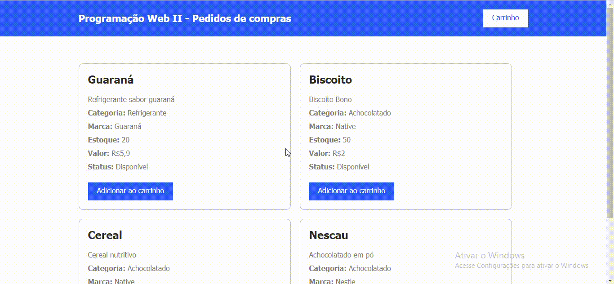
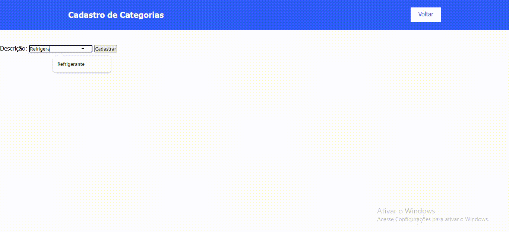
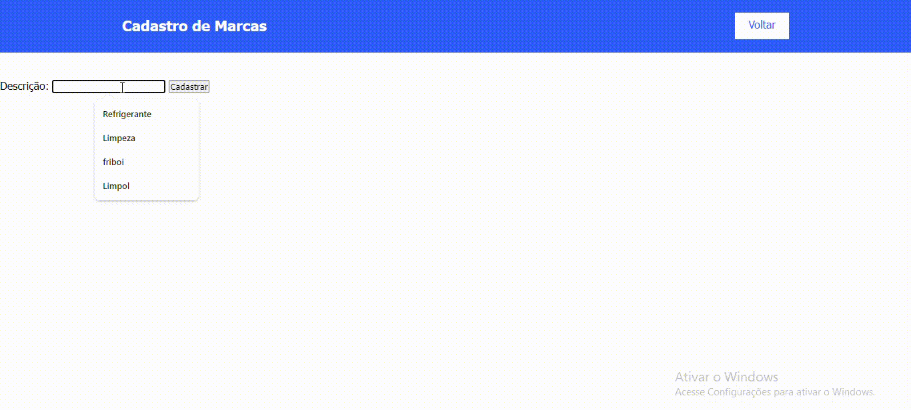
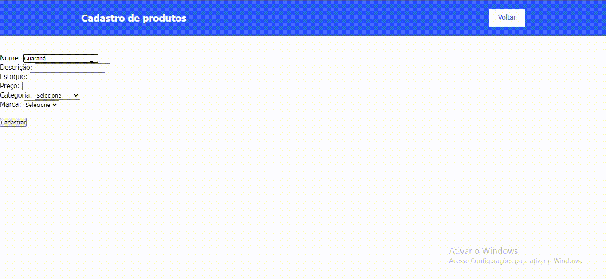

# Sistema-de-compras-com-PHP

O repositório inclui o projeto realizado em sala, que tem como objetivo a aprendizagem de métodos de conexão de banco de dados e construção de páginas web interligadas. 

## Aprendizados

Com o intuito de auxiliar na construção do MVP exigido pelo projeto de TCC do 3°C, o orientador auxiliou na construção de um site de compras que conta com um banco de dados mais avançado do que aqueles já construídos anteriormente em sala, utilizando diversos métodos PHP novos para tal. Como principal aprendizado tivemos a aplicação desses métodos de forma independente dentro do site que tem sido construído em sala.

## Métodos PHP

* `include_once` A declaração include_once inclui e avalia o arquivo informado durante a execução do script. Este é um comportamento similar a declaração include, com a única diferença que, se o código do arquivo já foi incluído, não o fará novamente, e o include_once retornará true. Como o nome sugere, o arquivo será incluído somente uma vez.

* `mysqli_query` Executa uma busca no banco de dados, como, por exemplo, na página de cadastro de produtos, onde ele realiza a busca do item descrição das tabelas categoria e marca.

* `mysqli_fetch_assoc` Obtém uma linha de dados do conjunto de resultados e retorna-o como um array associativo. Cada chamada subsequente desta função retornará a linha seguinte do conjunto de resultados, ou null se não houver mais linhas.

## Funcionalidades

### Carrinho de compras:

Nessa aba o cliente poderá ver os itens adicionado ao carrinho e então, caso seja de seu desejo, alterar o número de itens ou excluí-lo.

 

### Gerenciamento de produtos, marcas e categorias:

Para gerenciar o estoque e garantir que os clientes não ficarão sem produtos para comprar,  os itens serão sempre gerenciados e passarão pelas páginas de `cadastro de categorias` que será responsável por classificar o produto, como, por exemplo, diferir um item de limpeza de um de consumo humano; 

 

pela tela de `cadastro de marcas` onde será realizada a inserção da marca daquele produto;

 

e finalmente a aba `cadastro de produtos` que fica responsável por inserir os dados mais abrangentes do item, como nome, preço e descrição. Nessa aba você pode cadastrar determinado produto no banco de dados e atualizar o estoque da loja.

 

## Ferramentas utilizadas

`VS Code`
`Xampp`

## Tecnologias utilizadas

`HTML 5`
`JavaScript`
`PHP`

## Autores

Vitória Gabrieli

Orientador Leonardo Rocha  
[Acesse o GitHub](https://github.com/LeonardoRochaMarista)

